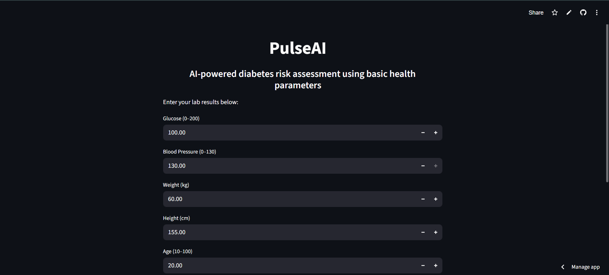
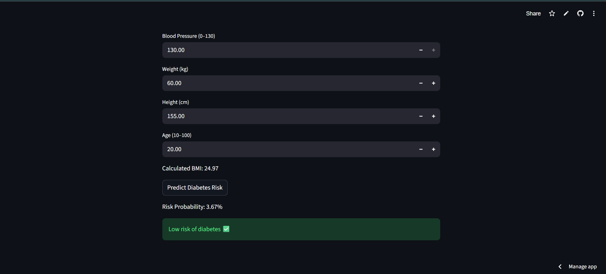

# 🧠 PulseAI – Diabetes Risk Prediction App

PulseAI is a machine learning-based web application that predicts the risk of diabetes using basic health parameters such as glucose level, blood pressure, BMI, and age. It is built using Python, Scikit-learn, and Streamlit, and deployed as an interactive web app.

---

## 🚀 Live Demo

👉 https://pulseai-hp.streamlit.app/

---

## 📸 Project Preview





---

## 📌 Features

- Simple Streamlit web interface  
- Takes user health inputs  
- Automatically calculates BMI  
- Predicts diabetes risk in real time  
- Shows probability score (%)  
- Fast and lightweight ML model  

---

## 🧠 How It Works

- User enters health details  
- BMI is calculated using height & weight  
- Data is scaled using StandardScaler  
- Logistic Regression model predicts outcome  
- Result is displayed as Low / High risk  

---

## 🏗️ Project Structure

```
PulseAI/
│
├── app.py              # Streamlit web app
├── train.py            # Model training script
├── diabetes.csv        # Dataset
├── model.pkl           # Trained ML model
├── scaler.pkl          # Scaler for preprocessing
├── requirements.txt    # Dependencies
└── README.md           # Project documentation
```

---
